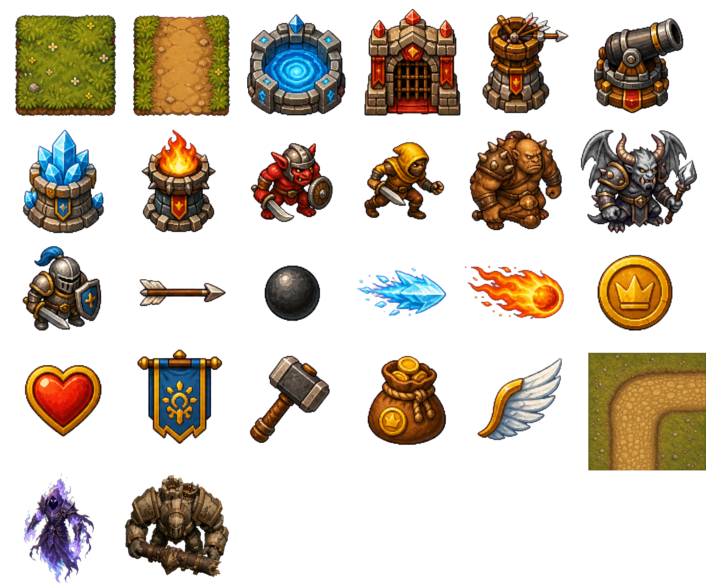

# Rune Siege TD

Rune Siege TD is a single-player, fantasy tower-defense prototype written in [Odin](https://odin-lang.org/) with Raylib. Build towers on the grid, stop enemies before they reach the exit, and clear a three-level campaign.



## Current features

- Three sequential maps: **Grasslands**, **Forest Pass**, and **Frozen Road**.
- 55 hand-authored waves, including fast, armored, brute, and boss enemies.
- Four tower families:
  - **Arrow** — quick physical single-target damage.
  - **Cannon** — physical splash damage.
  - **Frost** — magic damage that slows enemies.
  - **Flame** — elemental splash damage with burn.
- Three tower levels, 70% sell refunds, gold rewards, lives, and 1×–3× game speed.
- Pause menu, restart flow, victory/defeat screens, high-DPI support, and a resizable letterboxed window.
- A painted fantasy sprite atlas with safe primitive-rendering fallbacks when the atlas is unavailable.

## Requirements

- [Odin](https://odin-lang.org/docs/install/) with its Raylib vendor package available.
- A desktop environment capable of running Raylib applications.

## Build and run

From the repository root:

```sh
odin check src
odin build src -out:build/game
./build/game
```

On Windows, run `build/game.exe` instead.

## How to play

Enemies travel along the brown paths from blue spawn tiles to red exit tiles. Select a tower, then left-click an empty green tile to build it. Click an existing tower to inspect it and upgrade or sell it.

| Action | Keyboard | Mouse |
| --- | --- | --- |
| Choose Arrow / Cannon / Frost / Flame | `1` / `2` / `3` / `4` | Tower cards in the side panel |
| Place or select a tower | — | Left-click a map tile |
| Start a wave | `Space` | **Start Wave** button |
| Change game speed | `-` / `=` | Speed buttons |
| Upgrade selected tower | `U` | **U** button |
| Sell selected tower | `S` | **S** button |
| Clear selection | — | Right-click |
| Open or close pause menu | `Esc` | **Menu** button / menu controls |
| Restart from pause menu | `R` | **Restart** button |
| Quit from pause menu | `Q` | **Quit** button |

Each completed wave awards gold and starts a short countdown to the next one. A level is won when all waves are cleared and lost when lives reach zero. Press `Enter` or click the result button to retry after defeat or continue after a non-final level victory.

## Project layout

```text
src/
  main.odin         Application setup and game loop
  game.odin         Shared types, state, input, and update orchestration
  map.odin          Map tiles, paths, and placement preview
  waves.odin        Levels, waves, spawning, and level reset
  towers.odin       Tower placement, upgrades, targeting, and rendering
  enemies.odin      Movement, health, damage resistance, and status effects
  projectiles.odin  Projectile behavior and splash hits
  effects.odin      Temporary combat visual effects
  ui.odin           HUD, menus, and virtual-resolution rendering
  assets.odin       Sprite-atlas loading and lookup
assets/
  sprite_atlas.png  Runtime art atlas
  ART_GUIDE.md      Atlas layout and replacement guidance
```

## Development notes

The project is an intentionally compact prototype. Tower, enemy, wave, and level data are currently hard-coded in `src/game.odin` and `src/waves.odin`; external data files, audio, saved progression, scoring, additional targeting policies, and mixed-enemy waves are planned but not yet implemented.

See [DESIGN.md](DESIGN.md) for the broader game design direction, [PROGRESS.md](PROGRESS.md) for the current implementation status, and [assets/ART_GUIDE.md](assets/ART_GUIDE.md) for artwork replacement instructions.
